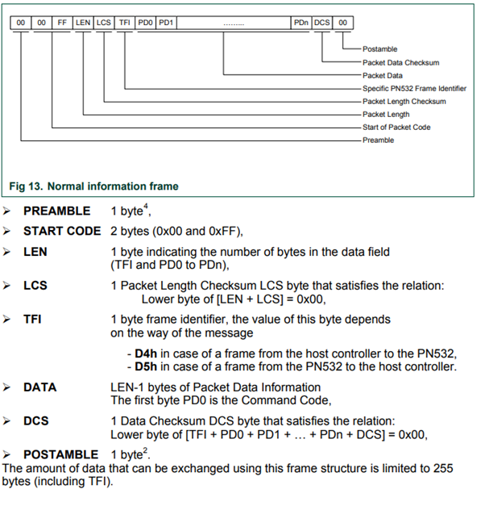
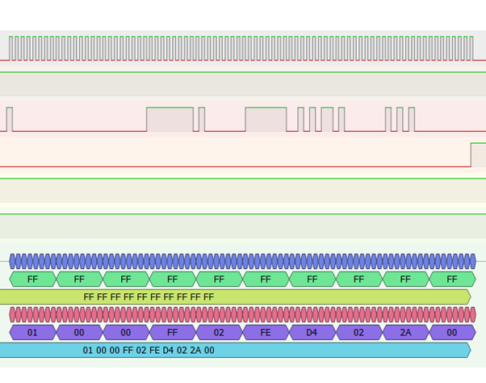
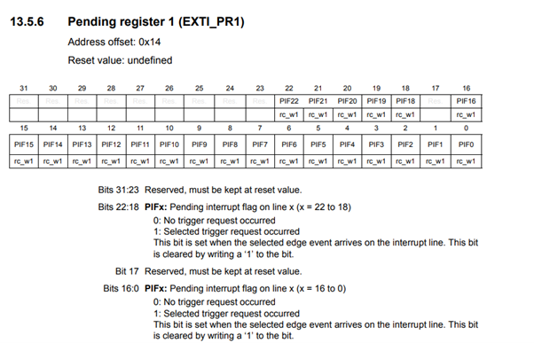

# STM32 UID Authentication System Using Bare Metal Coding

A lightweight embedded NFC UID authentication system for the STM32L432 microcontroller using the PN532 NFC module (SPI mode). This project was developed with PlatformIO in VSCode using bare-metal programming techniques to gain full hardware control. The system is capable of adding, removing, and authenticating NFC tag UIDs. Extensive debugging and protocol validation have been carried out using logic analyzers, register inspection, and reference to official datasheets and user manuals.

---

## Objectives

This project aims to implement a lightweight embedded authentication system using NFC technology. The main objectives were to:

- Build a bare-metal firmware for STM32 that communicates with the PN532 NFC module.
- Authenticate tag UIDs and manage a whitelist over a UART menu.
- Validate all SPI communication and interrupt handling using hardware tools.

---

## Features

- Add, remove, and authenticate NFC tag UIDs using the PN532
- Menu-driven UART interface for user interaction
- SPI-based communication with custom command framing and ACK validation
- Clean, modular codebase with dedicated modules for SPI, NFC protocol, and hardware abstraction
- Designed for the STM32L432 but adaptable to other STM32 series
- Comprehensive debugging evidence documented via logic analyzer captures and register views

---

## Requirements

- STM32L432 development board (or similar STM32 board)
- PN532 NFC module configured for SPI mode
- PlatformIO with VSCode
- NFC tags or cards
- Serial monitor (use the one in VSCode/PlatformIO or your preferred terminal)

> **Note:** Timers, ADC/DAC were not used as they were not necessary for the scope of this NFC-based authentication system. All timing was handled by polling and logic analyzer timing where applicable. GPIOs and interrupts were extensively used instead.

---

## Pin Configuration (STM32L432 ↔ PN532)

| STM32 Pin | PN532 Signal | Description                  |
|-----------|--------------|------------------------------|
| PA1       | SCLK         | SPI Clock                    |
| PA7       | MOSI         | SPI Data Out                 |
| PA11      | MISO         | SPI Data In                  |
| PB0       | SS           | Chip Select (manual control) |
| PA8       | RESET        | PN532 Reset line             |
| PB1       | IRQ          | PN532 Interrupt (active low) |

> **Note:** Ensure that the PN532 is set to **SPI mode** by verifying its jumper configuration.

## Pin Configuration (ST32L432 ↔ Terminal)
| STM32 Pin | Function     | Description                  |
|-----------|--------------|------------------------------|
| PA2       | USART2_TX    | UART output to terminal      |
| PA15      | USART2_RX    | UART input from terminal     |

> **Note:** PA15 and PA2 require no external wiring as they are internally connected to the USB port

---

## Getting Started

### 1. Clone the Repository

```bash
git clone https://github.com/CorcKilian/PN532-STM32-BareMetal
cd PN532-STM32-BareMetal
```

### 2. Open with VSCode

Ensure that the PlatformIO extension is installed in VSCode.

### 3. Build and Upload

You can either run the following command in the terminal:

```bash
pio run --target upload
```
Or use the "Upload" button in the PlatformIO toolbar inside VSCode to flash the firmware to your STM32 board.

### 4. Open Serial Monitor

Use PlatformIO’s built-in serial monitor or your preferred terminal at a default baud rate of `9600`.

---

## UART Menu System

After  uploading the program, open the serial monitor and press any key to display the following menu:

```
--- UID Authentication System ---
1. Add UID to Whitelist
2. Authenticate UID
3. Remove UID from Whitelist
```

### Example Usage

- **Add UID:** Press `1` and scan a tag to add its UID to the whitelist.
- **Authenticate UID:** Press `2` and scan a tag; the system checks the whitelist and grants or denies access.
- **Remove UID:** Press `3` and scan a tag to remove it from the whitelist.

---

## Project Structure

| File             | Description                                  |
|------------------|----------------------------------------------|
| `main.c`         | Main loop, state machine, and UART menu      |
| `auth.c/h`       | UID whitelist management functions           |
| `PN532.c/h`      | Low-level communication with the PN532 module |
| `spi.c/h`        | SPI abstraction layer                        |
| `eeng1030_lib.c/h` | Clock, GPIO, and system utilities            |

---

## PlatformIO Configuration

The project uses `platformio.ini` to define the board and build environment. Ensure your board name (e.g., `nucleo_l432kc`) matches your hardware setup.

---

## Debugging and Protocol Validation

This section documents the detailed debugging and validation process carried out during development. It includes logic analyzer captures, register inspections, and command-response verification to prove that the system behaves as expected.

### SPI Frame and Data Exchange

- **Frame Format Expected by PN532:**  
    
  **Explanation:** We want to ensure that our command frames match the PN532 protocol. This image shows the expected format—including the preamble, start code, length, checksum, data payload, and postamble—which guides our implementation of `sendCommand()`. 

- **Detailed Frame Structure:**  
    
  **Explanation:** A detailed breakdown of the command frame’s structure. This helps verify that every byte is in the correct order and that the checksum is computed properly.

- **Correctly Formatted Frame on Logic Analyzer:**  
    
  **Explanation:** This capture confirms that the transmitted SPI frame complies with the PN532's expected format, ensuring reliable communication.

- **Normal SPI Data Exchange:**  
    
  **Explanation:** Displays a complete SPI exchange including the command packet, the PN532’s ACK, the response packet, and the host’s optional ACK. This demonstrates end-to-end data flow.

---

### External Interrupt (EXTI) and Register Configuration

- **GPIO Mapping for EXTI:**  
    
  **Explanation:** To trigger an interrupt when PB1 goes low, we first examine the GPIO mapping for external interrupts. This image shows which pins can be used for EXTI, which is essential for configuring the IRQ for the PN532.

- **EXTI Line Connections:**  
    
  **Explanation:** This diagram shows the connection of EXTI lines across the STM32 ports, indicating configurable and non-configurable lines. It provides the context needed for setting up PB1 as the IRQ input.

- **EXTICR Register View:**  
    
  **Explanation:** To configure the interrupt, we use the EXTI configuration register (EXTICR). This image displays the register layout, which is used to map EXTI1 to the desired port (e.g., PB1).

- **EXTICR Bit Configuration:**  
    
  **Explanation:** Details the bit settings required for assigning EXTI1 to the correct pin. This ensures that when PB1 goes low, an interrupt is triggered as intended.

- **Interrupt Mask Register (IMR):**  
    
  **Explanation:** This image shows the interrupt mask register, which must be managed to enable or disable interrupts.

- **Rising Trigger Selection Register (RTSR):**  
    
  **Explanation:** Configuring the rising edge trigger is crucial to avoid false interrupts. Here, rising edge detection is disabled.

- **Falling Trigger Selection Register (FTSR):**  
    
  **Explanation:** The falling edge trigger is enabled so that a low on PB1 (IRQ signal) correctly triggers the interrupt.

- **Pending Register (PR):**  
    
  **Explanation:** The pending register indicates when an interrupt has been flagged. It is cleared by writing a '1' to it, which is important for debugging interrupt behavior.

---

### Debugging the Interrupt Issue

- **Pre-Transfer Debug View:**  
    
  **Explanation:** Before SPI data transmission, we examine the pending register to ensure no interrupts are flagged inadvertently.

- **During SPI Data Transmission (Transfer Highlight):**  
    
  **Explanation:** This image shows the code line that sends data over SPI. It is critical to monitor this step, as spurious interrupts during this phase can disrupt communication.

- **Spurious Interrupt Triggered:**  
    
  **Explanation:** Captures an unexpected interrupt, likely due to some hardware / crosstalk issue. Oscilloscope confirming no physical low on the IRQ line, however the system registers an interrupt.

- **Disabling EXTI Prior to Transmission:**  
    
  **Explanation:** To avoid false triggering, we temporarily disable the EXTI interrupt by modifying the IMR register before SPI transmission.

- **IMR Disabled Verification:**  
    
  **Explanation:** Verification that the interrupt mask is disabled. This prevents any unwanted interrupts during data transfer.

- **No Interrupt During SPI Activity:**  
    
  **Explanation:** With the interrupt mask disabled, the interrupt is no longer triggered, confirming our workaround.

- **Re-Enabling Interrupt After Transfer:**  
    
  **Explanation:** After the SPI transfer, the interrupt mask is re-enabled to restore normal IRQ behavior.

- **Sending a command with Interrupt workaround:**  
    
  **Explanation:** This verifies that we are sending correct PN532 command frames, the interrupt workaround is working. However this never returns an ACK and it was decided to give up on attempting an interrupt. 
> **Note:** Almost certainly the issue with recieving no ACK is due to not enough time being given of SS low before sending the command. The PN532 User Manual stipulates that 1ms be given. Future improvements on this code will likely use interrupts.

---

### PN532 Command and Response Verification

- **Get Firmware Version Command Sent:**  
    
  **Explanation:** To verify command transmission, we send the “Get Firmware Version” command—a safe command that does not alter system state. This capture confirms that the command is sent properly.

- **Firmware Version ACK Received:**  
    
  **Explanation:** Demonstrates that the PN532 acknowledges the firmware version command by sending an ACK, validating our transmission.

- **Command and ACK Handshake:**  
    
  **Explanation:** This handshake verifies that the command is received correctly by the PN532 and that the response is being prepared as expected.

- **Response Verification via Serial Monitor:**  
    
  **Explanation:** The serial monitor output confirms that the response from the “Get Firmware Version” command matches the expected data from the PN532 user manual.

- **Expected Firmware Response:**  
    
  **Explanation:** This image shows the expected firmware response, providing a reference to validate the actual output.

---

### SAM Configuration and General Status

- **SAM Configuration Command Reference:**  
    
  **Explanation:** Shows the SAM configuration command as defined in the PN532 user manual, essential for setting the module into the correct operational mode.

- **SAMConfig with ACK (Logic Analyzer):**  
    
  **Explanation:** Confirms that upon sending the SAMConfig command, an ACK is received from the PN532, verifying proper communication.

- **SAMConfig Response Capture:**  
    
  **Explanation:** Displays the actual response from the PN532 after SAM configuration, ensuring that the module is correctly configured.

- **General Status Command with ACK:**  
    
  **Explanation:** Captures the general status command along with its ACK, ensuring that the device is responding as expected.
  
- **General Status Response:**  
    
  **Explanation:** Shows the response received for the general status command, providing further evidence of proper system operation.
  
- **Expected General Status Response:**  
    
  **Explanation:** This image verifies that the general status response aligns with what is specified in the PN532 documentation, confirming proper SAM configuration.

---

### Tag Scanning and UID Capture

- **INLISTPASSIVETARGET Command with ACK:**  
    
  **Explanation:** This capture shows the command used to scan for a card and the corresponding ACK from the PN532, confirming the initiation of a tag scan.
  
- **Tag Response Packet:**  
    
  **Explanation:** Displays the response packet when a tag is detected, including the UID and other relevant parameters.
  
- **Response Byte Decoding:**  
    
  **Explanation:** Provides a table explaining the meaning of each byte in the tag response, crucial for validating the UID and communication parameters.
  
- **scanForTag() Function:**  
    
  **Explanation:** This image shows the scanForTag() function in action, including its retry mechanism when no tag is detected (retries ~ every 230ms for a total of 3 attempts (configurable)).
  
- **Successful Tag Scan:**  
    
  **Explanation:** Demonstrates that after several retries, a tag is successfully detected, verifying the reliability of the scanForTag() function.

---

## Software Design and Documentation

This project employs a modular, bare-metal C architecture based on the following principles:

- **Direct Hardware Control:** All peripheral interactions (SPI, GPIO, interrupts) are handled through direct register manipulation, bypassing vendor HAL libraries.
- **Modular Structure:** Separate modules for NFC communication (`PN532.c/h`), SPI transfer (`spi.c/h`), and system-level utilities (`eeng1030_lib.c/h`) allow for easy maintenance and scalability.
- **Robust Debugging:** Extensive use of logic analyzers, register inspections, and serial monitor outputs ensures each communication step is verified and validated.
- **Comprehensive Documentation:** Inline comments, this README, and supplementary images provide a detailed account of system design, testing, and debugging in line with industrial standards.

---

## Testing and Debugging Procedures

### Debugging Tools and Methods

- **Logic Analyzer and Oscilloscope:** Used to capture SPI signals, verify command structures, and measure IRQ timings.
- **Serial Monitor (USART2):** Provides real-time output of command execution and system responses.
- **Register Inspection:** CMSIS and debugger tools were used to examine and modify EXTI, SYSCFG, and other registers.

### Functional Testing

- **SAM Configuration:** Verified through ACK and response packets that the PN532 entered the correct operational mode.
- **Firmware Version Check:** The “Get Firmware Version” command was sent and its response verified against the PN532 user manual.
- **Tag Scanning:** The scanForTag() function implements a retry mechanism, ensuring robust tag detection even under suboptimal conditions.
- **Interrupt Handling:** Disabling and re-enabling interrupts during SPI transfers proved essential in mitigating false triggers, as evidenced by our register captures and logic analyzer data.

---

## Circuit Schematic and Demonstration

- **Circuit Schematic:** A schematic (created with KiCad) details the connections between the STM32 board and the PN532 module.  
    
  **Explanation:** This schematic illustrates how the STM32 pins are connected to the PN532.

- **Video Demonstration:** A brief demonstration video has been uploaded to YouTube, showcasing the system’s functionality in real time.  
  [Watch the Demo](https://youtu.be/Bl1eRp9tZyk)

---

## License

This project is licensed under the [MIT License](./LICENSE).

---

*This README integrates detailed protocol analysis, debugging evidence, and thorough documentation to demonstrate robust design, testing, and development practices in compliance with the assignment criteria.*
